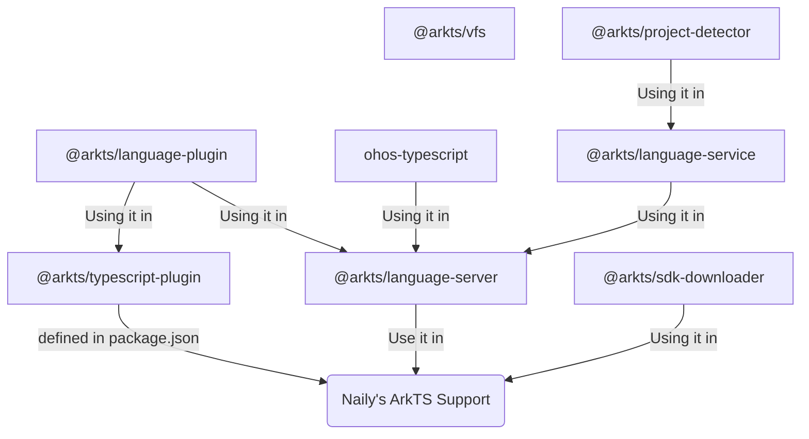

由于插件本身为了兼容性考虑，本插件只会屏蔽掉您指定的 `OpenHarmony SDK` 目录中的 `TypeScript` 文件的所有功能，并只保留 `ArkTS` 语言服务器提供的高亮、补全等LSP功能; 如果您遇到调整 `Promise.allSettled` 等之类的类型出现大面积报红，可以在您的项目根目录创建一个 `tsconfig.json` 文件，并添加以下内容：

```json
// This file using for Naily's ArkTS Support vscode extension.
{
  "compilerOptions": {
    "target": "ES2022",
    "module": "ES2022",
    "moduleResolution": "Bundler",
    "strict": true,
    "skipLibCheck": true
  }
}
```

此时，`vscode 内置的 TypeScript 语言服务器`就能正确识别到 `Promise.allSettled` 等之类的声明文件，能减少这类报红的出现。

## 插件架构



- `@arkts/language-plugin`: `volar` 语言插件扩展，主要处理不同环境下（TS插件环境/LSP语言服务器环境）针对不同的文件屏蔽不同的功能。
- `@arkts/typescript-plugin`: `TypeScript` 语言插件，内置在 `Naily's ArkTS Support` vscode 插件中，它使用 `@arkts/language-plugin` 屏蔽掉了 `OpenHarmony SDK` 目录中的 `TypeScript` 文件的所有LSP功能；
- `@arkts/project-detector`: 基于 `Rust` 编写的项目分析器，指定一个基础工作目录，扫描此目录下所有鸿蒙工程，并提供 `NAPI 绑定` 到 `TypeScript`，仓库地址：[https://github.com/ohosvscode/project-detector](https://github.com/ohosvscode/project-detector)
- `@arkts/language-service`: `ArkTS` 语言额外的一些语言功能服务，它依赖于 `@arkts/project-detector` 项目分析器，提供一些额外的补全功能如 `$r` 函数的补全和跳转、`module.json5` 文件的补全和跳转等功能；
- `@arkts/language-server`: `ArkTS` 语言服务器。它提供一个 `bin` 可以直接运行，同时也内置在了 `Naily's ArkTS Support` vscode 插件中。
- `@arkts/sdk-downloader`: `OpenHarmony SDK` 下载器，用于流式下载 `OpenHarmony SDK`，并提供 `github action` 直接可用于你的 GitHub Action 的 CI/CD 流水线中。
- `@arkts/vfs`: 基于 `ArkTS` 的虚拟文件系统，为 `ArkTS` 版 [twoslash](/twoslash/guide) 提供基础支持。

> 基本上核心的几个包就这些，还有一些非核心的如 `@arkts/shared` 等这边就不一一列举了。
