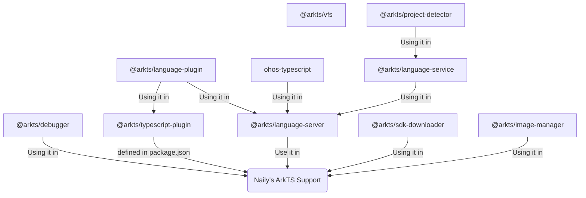

import { LinkCard, CardGrid, Card } from '@astrojs/starlight/components';

本插件衍生出了一系列包括但不限于研究和逆向 `DevEco Studio` 本身而诞生出来的子项目，作者通通将其封装成了一系列的 `npm` 包，提供编程式的API供本插件以及广大其他开发者直接使用。

## 独立仓库项目

下面是一些独立仓库项目，由于一些原因（如：该功能通过逆向 `DevEco Studio` 本身）因此没有放在 [ohosvscode/arkTS](https://github.com/ohosvscode/arkTS) 仓库中，而是独立成一个仓库，方便其他开发者研究学习使用。

<CardGrid>
  <LinkCard title="@arkts/debugger" href="https://github.com/ohosvscode/debugger" description="鸿蒙 ArkTS 项目调试器。该 npm 包通过研究 DevEco Studio 本体而诞生，感谢 github@sanchuanhehe 的逆向成果。" />
  <LinkCard title="@arkts/image-manager" href="https://github.com/ohosvscode/image-manager" description="鸿蒙模拟器镜像管理器, 用于管理鸿蒙模拟器镜像的下载、安装、删除等操作。该 npm 包通过研究 DevEco Studio 本体而诞生。" />
  <LinkCard title="@arkts/project-detector" href="https://github.com/ohosvscode/project-detector" description="基于 Rust 编写的项目分析器，指定一个基础工作目录，扫描此目录下所有鸿蒙工程，并提供 NAPI 绑定到 TypeScript。" />
  <LinkCard title="@arkts/sdk-downloader" href="https://github.com/ohosvscode/sdk-downloader" description="OpenHarmony SDK 下载器，支持流式下载/接续下载 OpenHarmony SDK, 并提供 github action 直接可用于你的 GitHub Action 的 CI/CD 流水线中。" />
</CardGrid>

## 核心仓库项目

下面是一些包含在 [ohosvscode/arkTS](https://github.com/ohosvscode/arkTS) 仓库中的核心项目：

- `@arkts/language-plugin`: `volar` 语言插件扩展，主要处理不同环境下（TS插件环境/LSP语言服务器环境）针对不同的文件屏蔽不同的功能。
- `@arkts/typescript-plugin`: `TypeScript` 语言插件，内置在 `Naily's ArkTS Support` vscode 插件中，它使用 `@arkts/language-plugin` 屏蔽掉了 `OpenHarmony SDK` 目录中的 `TypeScript` 文件的所有LSP功能；
- `@arkts/language-service`: `ArkTS` 语言额外的一些语言功能服务，它依赖于 `@arkts/project-detector` 项目分析器，提供一些额外的补全功能如 `$r` 函数的补全和跳转、`module.json5` 文件的补全和跳转等功能；
- `@arkts/language-server`: `ArkTS` 语言服务器。它提供一个 `bin` 可以直接运行，同时也内置在了 `Naily's ArkTS Support` vscode 插件中。
- `@arkts/vfs`: 基于 `ArkTS` 的虚拟文件系统，为 `ArkTS` 版 [twoslash](/twoslash/guide) 提供基础支持。

> 基本上核心的几个包就这些，还有一些非核心的如 `@arkts/shared` 等这边就不一一列举了。
