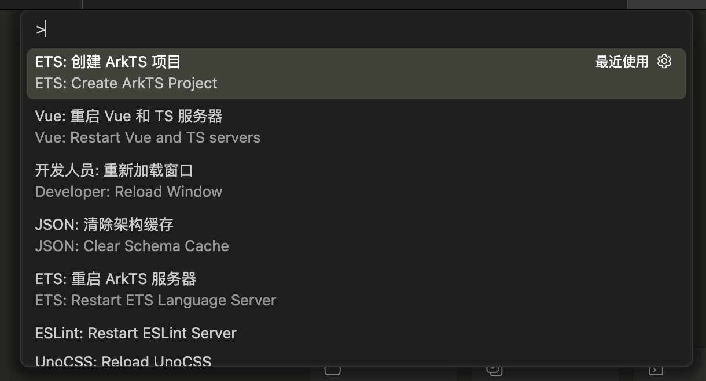
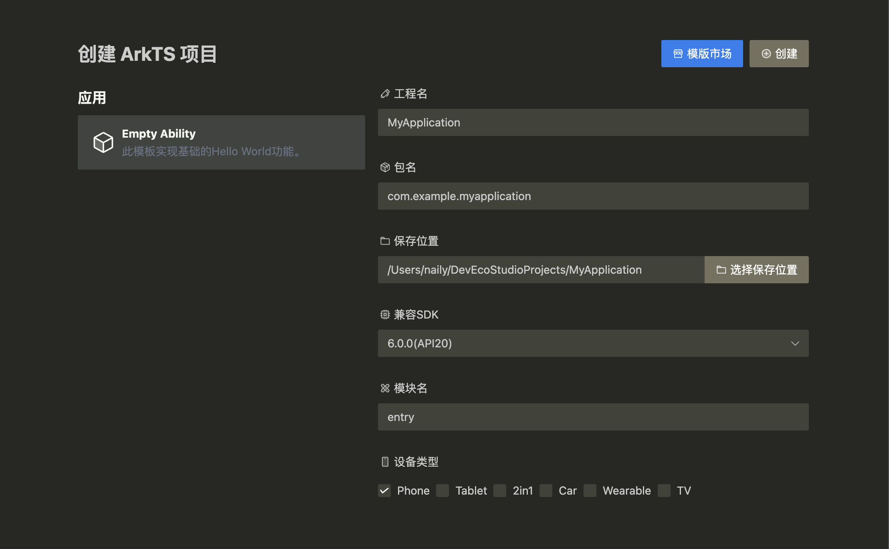
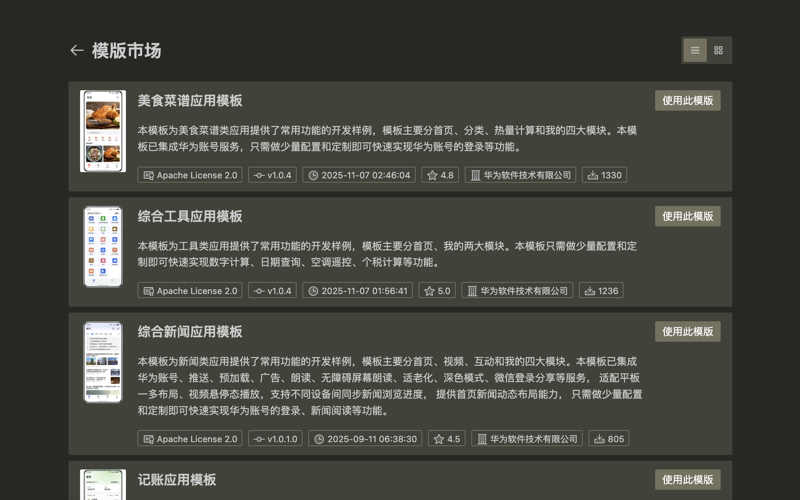
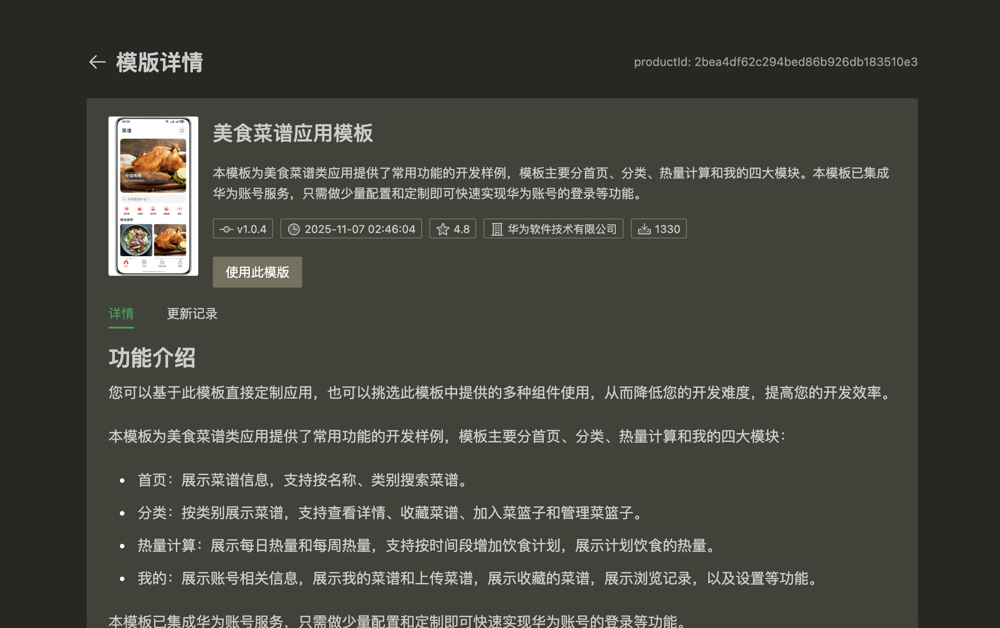
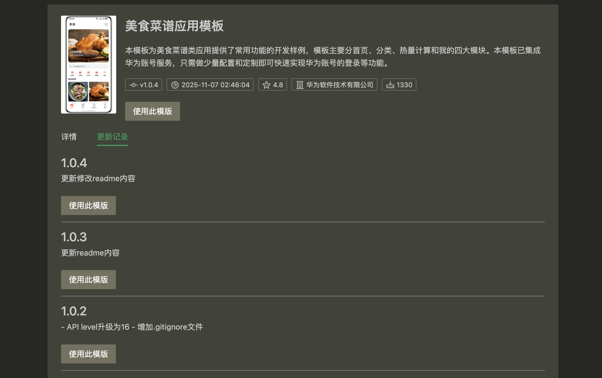

## 使用本地模版创建项目

您可以使用本插件自带的创建项目功能创建一个鸿蒙项目。打开您的 `类vscode` 编辑器，按下快捷键 `Ctrl + Shift + P` 或 `Cmd + Shift + P` 打开命令面板，输入 `ArkTS: Create Project` 并回车，即可创建一个鸿蒙项目。

或者，您可以在没有打开任何文件夹的情况下，在 `主侧栏` 找到 `创建 ArkTS 项目` 按钮：

  

打开后，进入项目创建向导页面，当前本地仅支持创建 `Empty Ability` 模版，后续会支持更多模版：

按照步骤填写或选择您的项目名称、包名、保存位置、API版本、模块名和设备类型等信息, 点击右上角的 `创建` 按钮，即可创建一个鸿蒙项目。

## 模版市场

您也可以点击右上角的 `模版市场` 按钮，进入模版市场页面，下载您所需要的模版。

:::note

该模版市场由华为生态市场提供, 详见: [https://developer.huawei.com/consumer/cn/market/prod-list?origin=template&ha_source=luntan&ha_sourceId=89000071](https://developer.huawei.com/consumer/cn/market/prod-list?origin=template&ha_source=luntan&ha_sourceId=89000071)

:::

点击您想要使用的模版，可以进入模版详情页面：

点击 `使用此模版` 按钮，选择一个文件夹，即可直接将当前模版的最新版本解压下载到本地。此外，您也可以切换到 `更新记录` 选项卡，使用该模版的历史版本来创建项目：

