import { LinkCard, CardGrid, Steps, Tabs, TabItem } from '@astrojs/starlight/components';

长久以来，鸿蒙开发只能在 `DevEco Studio` 中进行，而 `DevEco Studio` 的一些体验可能对一些人来说不是特别友好，毕竟它是基于 `idea` 系列的 IDE 二开的；同时，鸿蒙的开发语言 `ArkTS` 本身是基于 `TypeScript` Fork 二开出来的，而 `vscode` 本身也是基于 `TypeScript` 开发的，进而使我萌生出在 `vscode` 中开发鸿蒙项目的想法，并尝试研究它的可行性。

目前，实践证明，这一切是行得通的，目前该插件仍然在积极开发中，并且已经取得了一定的成果，目前已经支持以下功能：

- 1.x版本开始具备完整的`ArkTS`语言支持，全量支持所有`ArkTS`语法，包括各种 `代码补全`、`代码高亮`、`引用跳转`、`错误提示`、`代码格式化` 等完备的语言功能；
- 完善的`JSON Schema`支持。支持以下文件的`JSON Schema`：
  - `build-profile.json5` 模块级别/项目级别配置
  - `oh-package.json5` 模块级别/项目级别配置
  - `module.json5` 模块级别/项目级别配置
  - `code-linter.json5` 模块级别/项目级别配置
  - `resources/element/`下所有的`color.json`、`string.json`等的kv值配置
  - `main_pages.json5`
  - 以及更多!
- 1.x版本开始支持安装和管理`OpenHarmony SDK`，并且支持根据当前打开的项目自动探测`API版本`，发出弹窗提示`下载`或`切换`;
- 1.1.6+ 版本开始支持完美的 `$r` 函数补全和跳转、支持 `module.json5` 文件的补全和跳转、`resources/element/` 下所有`json`文件点击查询全局引用；由 [@arkts/project-detector](https://github.com/ohosvscode/project-detector) hvigor项目分析器提供强力支撑;
- 1.1.8+ 版本开始支持 `module.json5` 文件路径补全和跳转、引用表达式错误诊断、`requestPermissions` 权限补全等一系列新功能。

## 安装与配置

<Steps>
<ol>
  <li>

    ##### 安装插件

    目前，该插件在 `open-vsx` 和 `vscode marketplace` 上均可找到，直接在`类 vscode` 的编辑器中（如 `vscode`、`cursor`、`trae`、`argument`、`codebuddy`等）搜索 `Naily's ArkTS Support` 即可找到该插件。如果您搜不到该插件，可以点击下面的链接跳转到对应的商店页面进行安装：

    <CardGrid>
      <LinkCard title="vscode marketplace" description="点击前往 microsoft marketplace 进行安装。" href="https://marketplace.visualstudio.com/items?itemName=NailyZero.vscode-naily-ets" target="_blank" />
      <LinkCard title="open-vsx" description="点击前往 eclipse open-vsx 进行安装。" href="https://open-vsx.org/extension/NailyZero/vscode-naily-ets" target="_blank" />
    </CardGrid>

    :::note
    请注意，这个插件没有测试过与其他 `ArkTS` 语言插件同时安装等兼容性，如果遇到兼容性问题，请仅启用本 `ArkTS` 语言插件，其他插件请 `禁用` 或 `卸载`。

    

      
点击查看演示图片

      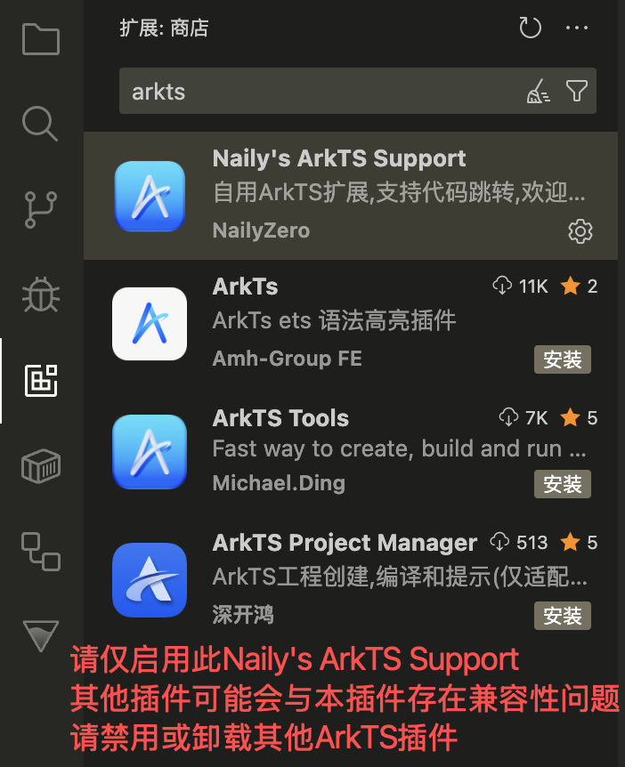
    

    :::

  </li>

  <li>

    ##### 配置 OpenHarmony SDK

    插件安装到IDE中后, 打开一个鸿蒙项目的文件夹，并打开一个 `.ets` 文件就能首次激活插件，同时，你就能看到这样的弹窗，让你选择或下载一个 `OpenHarmony SDK` :

    <Tabs>
      <TabItem icon="seti:windows" label="Windows">
        

          
        

      </TabItem>
      <TabItem icon="apple" label="MacOS">
        

          
        

      </TabItem>
    </Tabs>

    此时，您有三种方式配置 `OpenHarmony SDK`，下面将依次推荐这三种方式：

    ### 方法一: 选择自带在 DevEco Studio 中的 SDK (推荐)

    如果您的电脑中已经安装了 `DevEco Studio`, 您无需下载 `OpenHarmony SDK`, 因为 `DevEco Studio` 已经自带了 `OpenHarmony SDK`，您只需要选择已经安装在 `DevEco Studio` 中的 `OpenHarmony SDK` 即可:

    <Tabs>
      <TabItem icon="seti:windows" label="Windows">
        
        在 `Windows` 操作系统中，请找到您安装的 `DevEco Studio` 的安装目录。下面是一种典型的寻找 `DevEco Studio` 安装目录的方法：
        
        下面以 `Windows 11` 为例，请找到您的 `开始菜单`, 并找到 `DevEco Studio`, 右键点击并选择 `打开文件所在的位置`:

        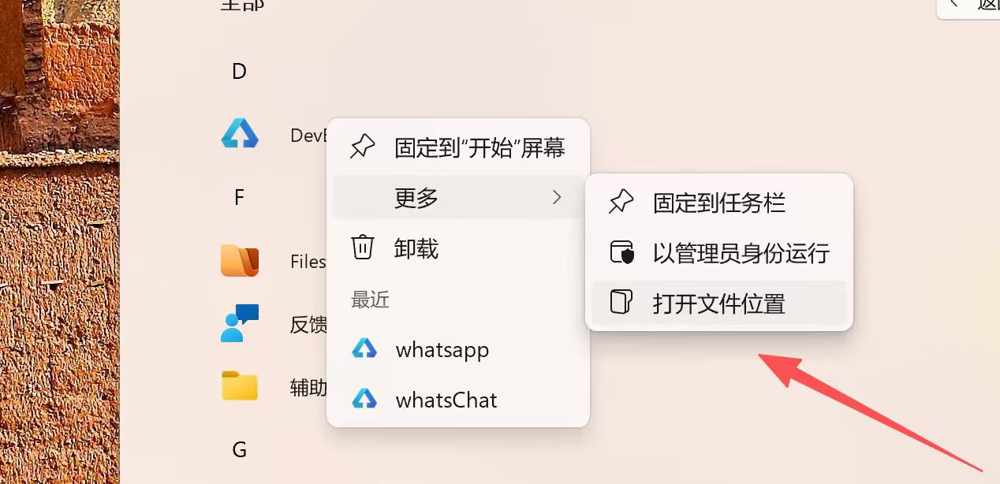

        然后现在来到了 `DevEco Studio` 的 `开始菜单快捷方式` 的存放目录，因为它仅是一个快捷方式，我们需要的是它指向的实际目录，因此我们对着这个 `DevEco Studio` 右键点击，选择 `打开文件所在的位置`:

        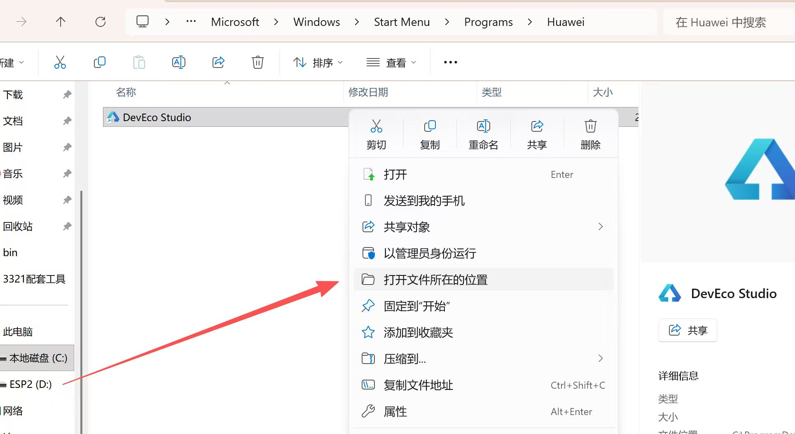

        然后您发现您跳到了 `DevEco Studio` 的安装目录了！但是目前我们是处于 `bin` 目录下，所以仍然需要返回一级目录，才是真正的 `DevEco Studio` 安装目录，点击地址栏的上一级返回上一级目录：

        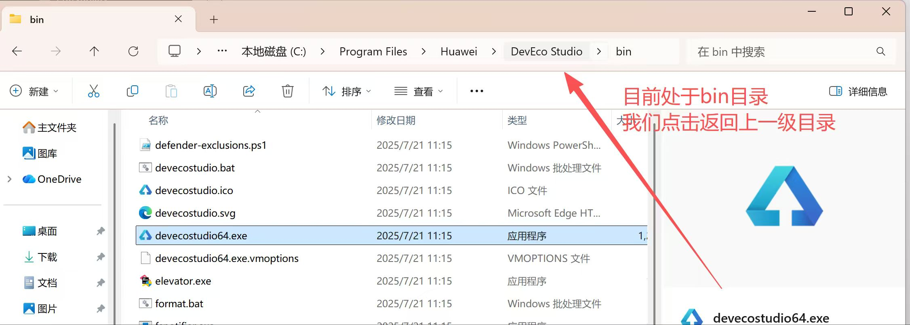

        然后，该目录有一个 `sdk` 文件夹，打开它：

        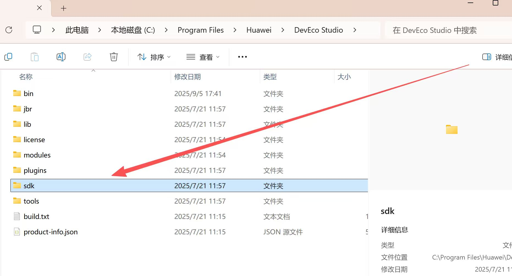

        一般来说这里会有一个 `default` 文件夹，打开它：

        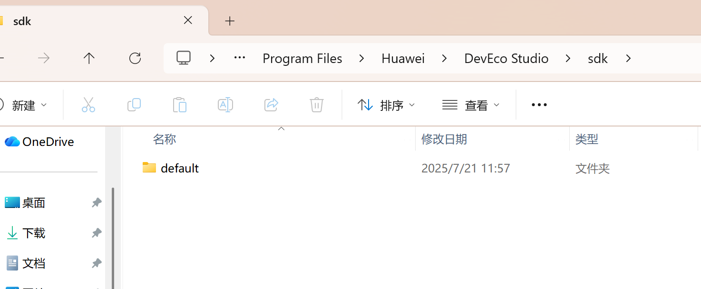

        然后，您就能看到一个 `openharmony` 文件夹，打开它: 

        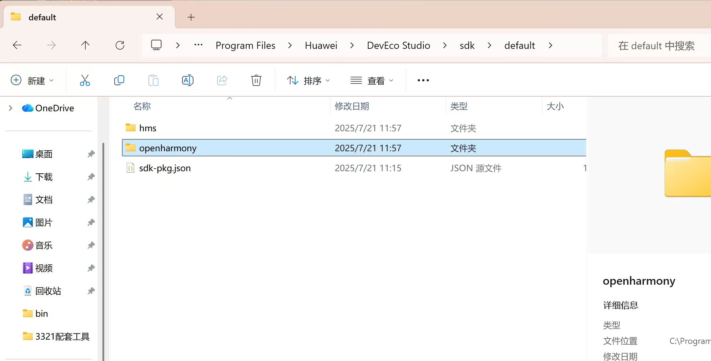

        这个文件夹里面存放的就是 `DevEco Studio` 默认自带的 `OpenHarmony SDK`，确认无误，复制这个路径地址：

        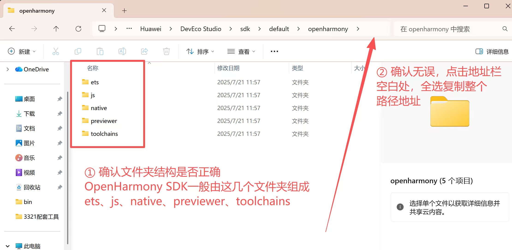

        然后，返回到 `vscode` 中，选择 `手动选择一个 OpenHarmony SDK 路径`, 打开文件夹选择框, 并在地址栏粘贴您刚刚复制的路径地址:

        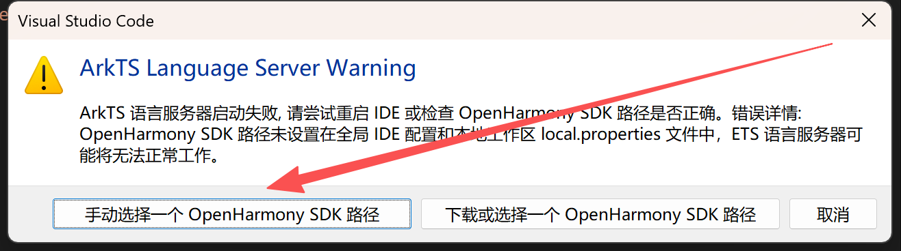

        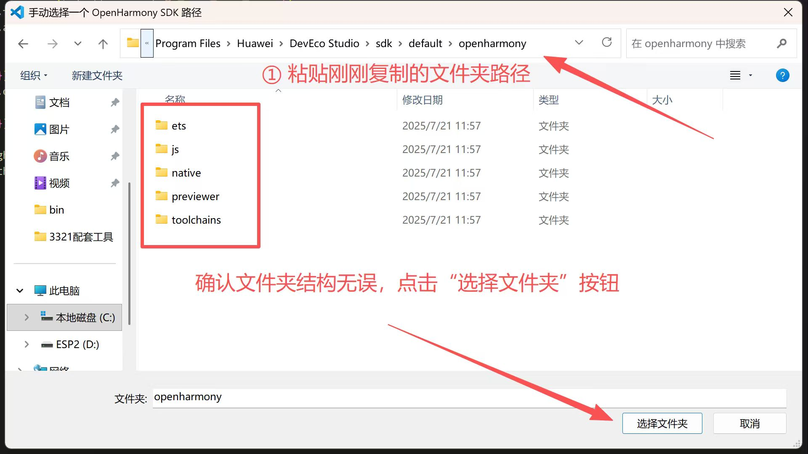

        一切完成！🎉 看看您的 `.ets` 文件是不是已经可以正常地使用补全、高亮、跳转、错误提示等所有代码功能了？
      </TabItem>
      <TabItem icon="apple" label="MacOS">
        在 `MacOS` 操作系统中，请打开 `访达`, 找到 `应用程序` 文件夹, 并找到 `DevEco Studio` 文件夹, 右键点击并选择 `显示包内容`:

        

          
        

        然后依次打开 `/Contents/sdk/default/openharmony` 文件夹, 并按住 `Option` 键并右键点击 `openharmony` 文件夹, 选择`将 "openharmony" 拷贝为路径名称`:

        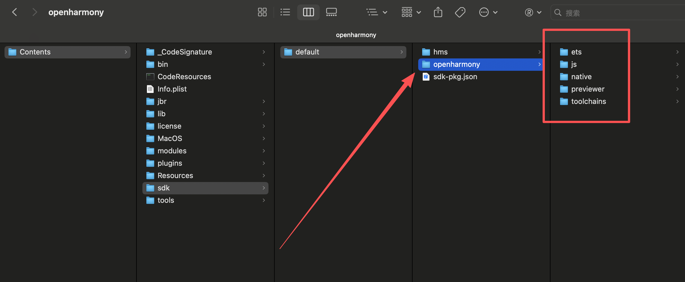

        然后, 回到 `vscode` 中, 选择 `手动选择一个 OpenHarmony SDK 路径`, 打开文件夹选择框, 并在地址栏粘贴您刚刚复制的路径地址:

        

          
        

        然后, 在文件夹选择框中按下 `Command + Shift + G` 快捷键, 打开 `前往文件夹` 输入框, 粘贴您刚刚复制的路径地址, 然后回车, 即可到达 您刚刚复制的路径地址; 并确认是否正确之后，点击 `打开` 按钮:

        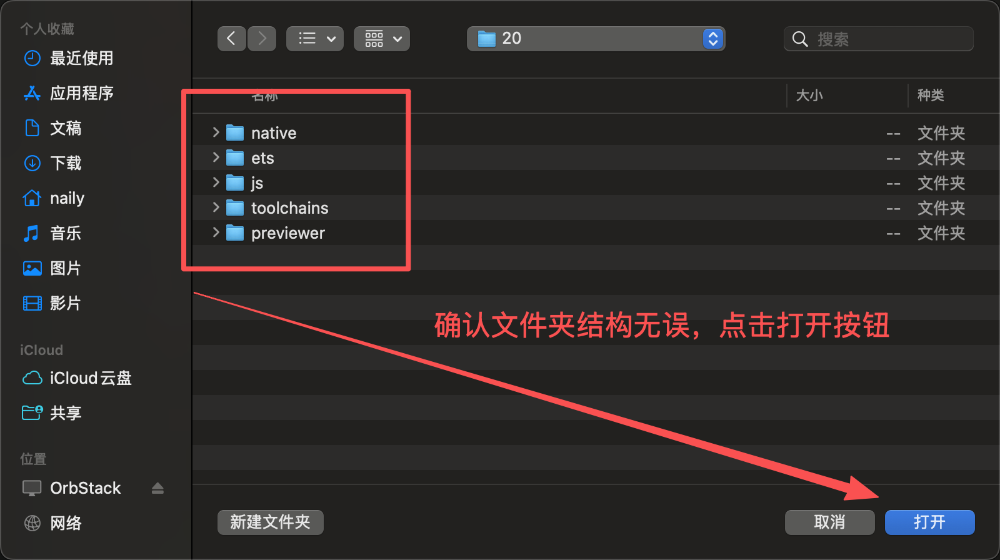

        一切完成！🎉 看看您的 `.ets` 文件是不是已经可以正常地使用补全、高亮、跳转、错误提示等所有代码功能了？
      </TabItem>
    </Tabs>

    ### 方法二: 选择DevEco Studio 设置中的 OpenHarmony SDK

    如果您找不到对应的目录（这通常与您使用的是较旧版的 `DevEco Studio` 有关），您也可以通过 `DevEco Studio` 的设置中的 `OpenHarmony SDK` 选项来找到 `SDK` 路径：

    <Tabs>
      <TabItem icon="apple" label="MacOS">
        打开 `DevEco Studio` 的设置，可以在欢迎页的右下角找到 `设置` 按钮，选择 `设置` 菜单项:

        

          
        

        然后在弹出的设置页面的左侧菜单项中找到 `OpenHarmony SDK` 选项，切换到该页面：

        

        可以看到这里罗列了多个 `OpenHarmony SDK` 的版本, 请先下载一个您需要的版本, 如果您不知道要下哪个版本的话, 那就下当前最新的版本即可。

        :::note

        请注意, 无论您想使用哪个SDK版本, 请把所有的选项（`ArkTS`、`JS`、`Native`、`Previewer`、`toolchains`等）全部都勾上，以避免出现缺少某些组件导致无法正常使用的情况。

        :::

        当您下载好之后，复制上面的 `OpenHarmony SDK位置` 路径地址，打开`访达`, 选择菜单里的`前往` -> `前往文件夹`，粘贴您刚刚复制的路径地址，然后回车，即可到达 `OpenHarmony SDK` 的安装目录:

        

          
        

        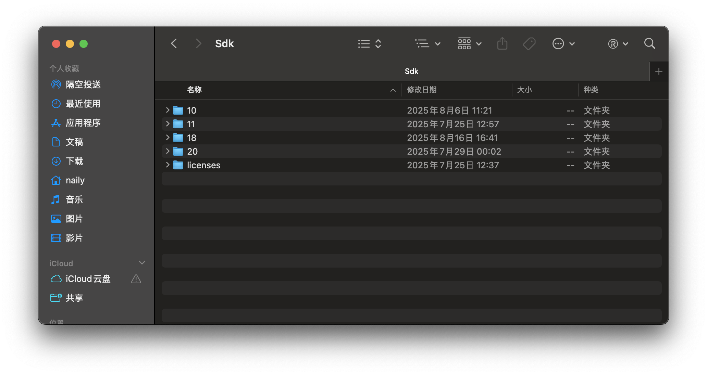

        这里的数字代表的就是`OpenHarmony SDK` 的版本号，您需要找到您刚刚下载的 `OpenHarmony SDK` 的版本号，然后按住键盘上的 `Option` 键并右键该文件夹，选择`将 (xx SDK版本) 拷贝为路径名称`, 复制该文件夹的路径，然后返回到 `vscode` 中，选择 `手动选择一个 OpenHarmony SDK 路径`, 打开文件夹选择框:

        

          
        

        然后，在文件夹选择框中按下 `Command + Shift + G` 快捷键，打开 `前往文件夹` 输入框，粘贴您刚刚复制的路径地址，然后回车，即可到达 您刚刚复制的路径地址:
        
        

        一切完成！🎉 看看您的 `.ets` 文件是不是已经可以正常地使用补全、高亮、跳转、错误提示等所有代码功能了？
      </TabItem>
    </Tabs>

    ### 方法三: 直接通过本 ArkTS 插件下载 SDK

    这个方法适用于您没有下载 `DevEco Studio` 或者您不想使用 `DevEco Studio` 中的 `OpenHarmony SDK` 的情况下。此时，插件本身也内置了 `OpenHarmony SDK` 的下载和管理功能可以供直接使用。

    首先，打开插件的设置页面，找到 `ets.baseSdkPath` 选项，该选项将作为插件 `下载` 和 `管理` `OpenHarmony SDK` 的基目录。默认情况下该路径为 `${os.homedir}/OpenHarmony`, 其中 `${os.homedir}` 代表您当前用户主目录。您也可以手动修改该路径，比如在 `Windows` 下您可能不会选择存放在 `C盘`, 毕竟单个版本的 `OpenHarmony SDK` 体积也是不小的，有 1~2 GB 不等。
    
    我这里是 `MacOS` 系统，所以就把路径修改为了和 `DevEco Studio` 一样的路径，即 `${os.homedir}/Library/OpenHarmony/Sdk`。

    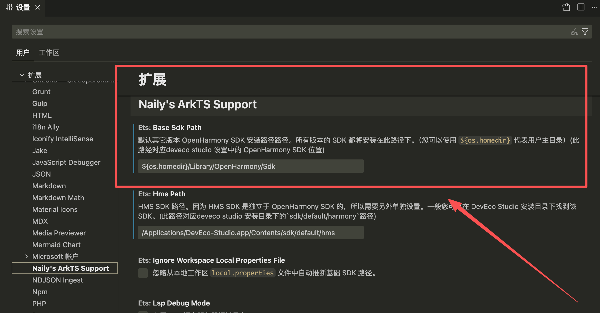

    然后，您就可以打开命令面板，找到 `ETS: Install/Switch OpenHarmony SDK` 命令，选择它：

    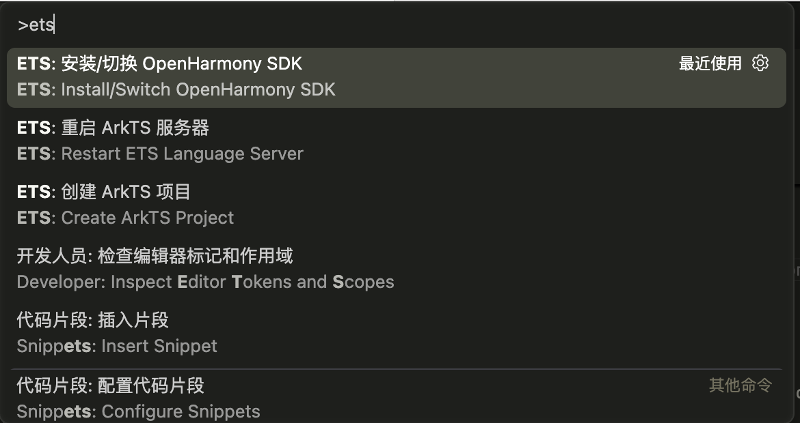

    然后，选择一个您想安装的 `OpenHarmony SDK` 版本，回车：

    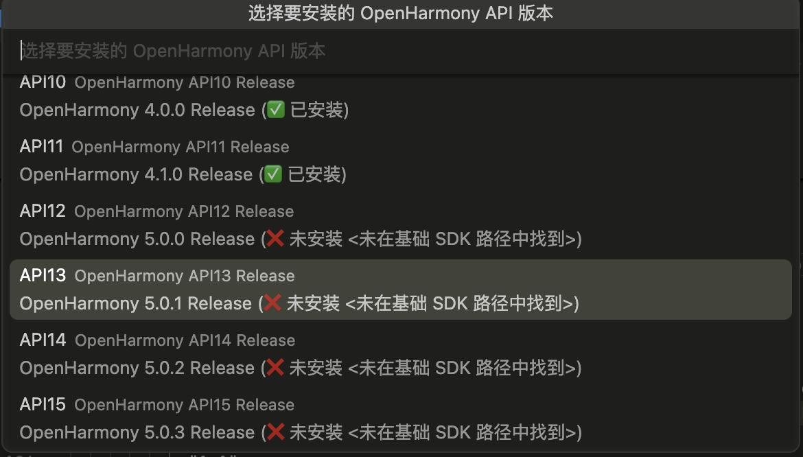

    然后，您就可以看到插件正在下载 `OpenHarmony SDK` 了，下方会有一个进度提示条，等待下载完成即可：

    

    您也可以随时取消下载，下次下载时会自动恢复从上次中断的地方继续下载。
  </li>
</ol>
</Steps>

